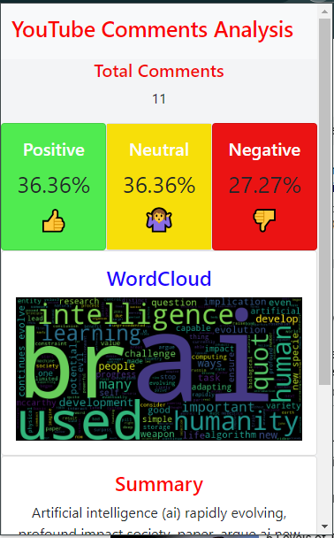

# Youtube Comment AnaLysier
- This project involves building a model that can function as a Chrome extension. When the user enables the extension, it automatically collects comments from a specific YouTube video and performs sentiment analysis on the comments. The model labels the comments based on their sentiment (positive, neutral, or negative), and visualizes the analysis through charts and graphs.

---

## Table of Contents

1. [About the Project](#about-the-project)
2. [Demo](#demo)
3. [Features](#features)
4. [Project Structure](#project-structure)
5. [Data Ingestion](#data-ingestion)
5. [Data Cleaning](#data-cleaning)
6. [Data Transformation](#data-transformation)
7. [Model Training](#model-training)
8. [Model Evaluation and Registration](#model-evaluation-and-registration)
8. [Deployment](#deployment)
9. [Extension Integration](#chrome-extension-integration)

---

## About the Project
- This project helps content creators quickly review and analyze YouTube comments.
- The project was developed to automate the process of collecting and analyzing comments for sentiment and insights.
- Main goals of the project:
    - Provide creators with a fast and efficient way to review their audience’s feedback.
    - Perform sentiment analysis to classify comments as positive, neutral, or negative.
    - Generate visual reports and charts to summarize comment sentiment and engagement trends.

## Built With

- **Frameworks and Tools**:
    - [Python 3.10+](https://www.python.org/)
    - [MLflow](https://mlflow.org/)
    - [Scikit-learn](https://scikit-learn.org/stable/)
    - [NLTK](https://www.nltk.org/)
    - [Matplotlib](https://matplotlib.org/)
    - [Seaborn](https://seaborn.pydata.org/)
    - [pandas](https://pandas.pydata.org/)
    - [NumPy](https://numpy.org/)
    - [FastAPI](https://fastapi.tiangolo.com/)
    - [Dagshub](https://dagshub.com/)

---

## Demo

(Optional) If your project is deployed, link the demo here.

For example:
[View Live Demo](http://example.com)

## Features

List key features of the project:
- Automatically fetches comments from YouTube videos via a Chrome extension.
- Performs sentiment analysis on comments.
- Visualizes results through charts for easy understanding.
- Helps content creators quickly review and analyze audience feedback.
- Summerize the whole comment.

## Project Structure

This section provides an overview of the folder structure of the project.

```plaintext
├── data
│   ├── raw             # Contains raw, unprocessed data
│   ├── processed       # Contains cleaned and processed data
├── models              # Contains saved machine learning models
├── notebooks           # Jupyter notebooks used for exploration and experimentation
├── src                 # Source code for the project
│   ├── data            # Data processing scripts (e.g., ingestion, cleaning, transformation)
│   ├── models          # Model definition, training, and evaluation scripts
│   ├── utils           # Utility functions for reuse in the project
│   └── tests           # Unit and integration test scripts
├── config              # Configuration files (e.g., config.yml)
├── reports             # Reports like visualizations, logs, or results
├── youtube-extension   # Chrome Extension for YouTube comments sentiment analysis
│   ├── assets          # Assets like icons
│   ├── scripts         # JavaScript files for the extension
│   ├── styles          # CSS for extension UI
├── README.md           # Project documentation (this file)
├── requirements.txt    # List of required packages and dependencies
├── LICENSE             # License file for the project
├── setup.py            # Script for packaging and installation
├── Dockerfile          # Docker configuration for containerizing the project
├── .gitignore          # Specifies which files/folders to ignore in version control
├── dvc.yaml            # DVC configuration file for data version controls
├── app.py              # Entry point for the project (e.g., web app or API)
├── .env                # Environment variables file
└── test_environment.py # Script to validate the environment setup
```

# Data Ingestion
- **Objective**: Retrieve data from the given source.
- **Data source**: [Reddit Sentiment Analysis CSV](https://raw.githubusercontent.com/Himanshu-1703/reddit-sentiment-analysis/refs/heads/main/data/reddit.csv)
- **Action**: After acquiring the data, it is stored in the `raw_data` folder for further processing.

## Data Cleaning
- **Objective**: Ensure the raw data is clean and ready for analysis.
- **Cleaning steps include**:
  - Handling missing values
  - Removing duplicates
  - Eliminating punctuation
  - Filtering out stopwords
  - Removing URLs
  - Decomposing emojis
- **Action**: Once cleaned, the data is saved in the `processed` folder for the next steps.

## Data Transformation
- **Objective**: Convert textual data into a numerical format suitable for model training.
- **Action**: Transformed data is made ready by converting text into numerical representations, as required by machine learning models.

## Model Training
- **Objective**: Train the model using the transformed data.
- **Action**: The model is trained with the numerical data and its performance is assessed.

## Model Evaluation and Registration
- **Objective**: Evaluate the model and register it for future use.
- **Action**: After evaluation, the model is registered in the **MLflow** model registry to ensure version control and future usability.
---

## API Endpoint
- **Objective**: Create an API endpoint for making predictions.
- **Action**: Load the model from the **MLflow registry** and use it to perform predictions via the API.

---
# Chrome Extension Integration

- **Objective**: We can integrate our model to chrome extension.
- **Action**: Get the comments of the video and perform following features.

    - **Ratio of comments**
    - **Summary Of the comments**
    - **Highlight Keywords**

---